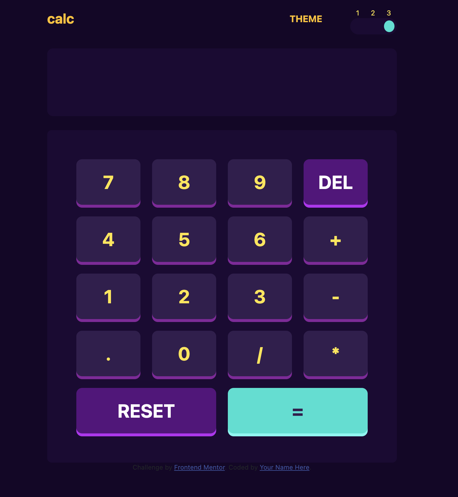

# Frontend Mentor - Calculator app solution

This is a solution to the [Calculator app challenge on Frontend Mentor](https://www.frontendmentor.io/challenges/calculator-app-9lteq5N29). Frontend Mentor challenges help you improve your coding skills by building realistic projects. 

## Table of contents

- [Overview](#overview)
  - [The challenge](#the-challenge)
  - [Screenshot](#screenshot)
  - [Links](#links)
- [My process](#my-process)
  - [Built with](#built-with)
  - [What I learned](#what-i-learned)
  - [Continued development](#continued-development)
  - [Useful resources](#useful-resources)
- [Author](#author)
- [Acknowledgments](#acknowledgments)

**Note: Delete this note and update the table of contents based on what sections you keep.**

## Overview

### The challenge

Users should be able to:

- See the size of the elements adjust based on their device's screen size
- Perform mathmatical operations like addition, subtraction, multiplication, and division
- Adjust the color theme based on their preference
- **Bonus**: Have their initial theme preference checked using `prefers-color-scheme` and have any additional changes saved in the browser

### Screenshot




### Links

- Solution URL: [Add solution URL here](https://github.com/samlobeng/calculator-ap)
- Live Site URL: [Add live site URL here](https://samlobeng.github.io/calculator-app/)

## My process

### Built with

- Semantic HTML5 markup
- CSS custom properties
- Flexbox
- CSS Grid
- Mobile-first workflow
- [Bootstrap](https://getbootstrap.com/) - UI library


### What I learned

I learned how to use the eval method in javascript to evaluate every code in the display box as a javaScript and execute it.
I also learned more about css grid.

```js
function setMultipleProperties(styleObject, properties) {
    Object.keys(properties).forEach(property => {
      styleObject.setProperty(property, properties[property].value, properties[property].priority);
    });
  }
```
```js
const calculateResults = function(){
    try {
        if(display.value.length > 0){
            display.value = eval(display.value)
        }else{
            throw new Error("Empty field")
        }
    } catch (error) {
        console.log(error.message)
    }
}
```


## Author

- Website - [Samuel Obeng](https://github.com/samlobeng/)
- Frontend Mentor - [@samlobeng](https://www.frontendmentor.io/profile/samlobeng)
- Twitter - [@S_ObengGh](https://www.twitter.com/S_ObengGh)

